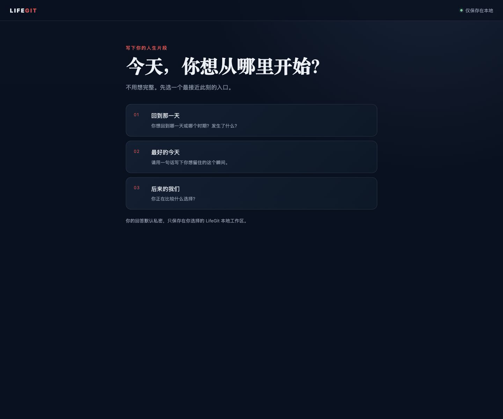
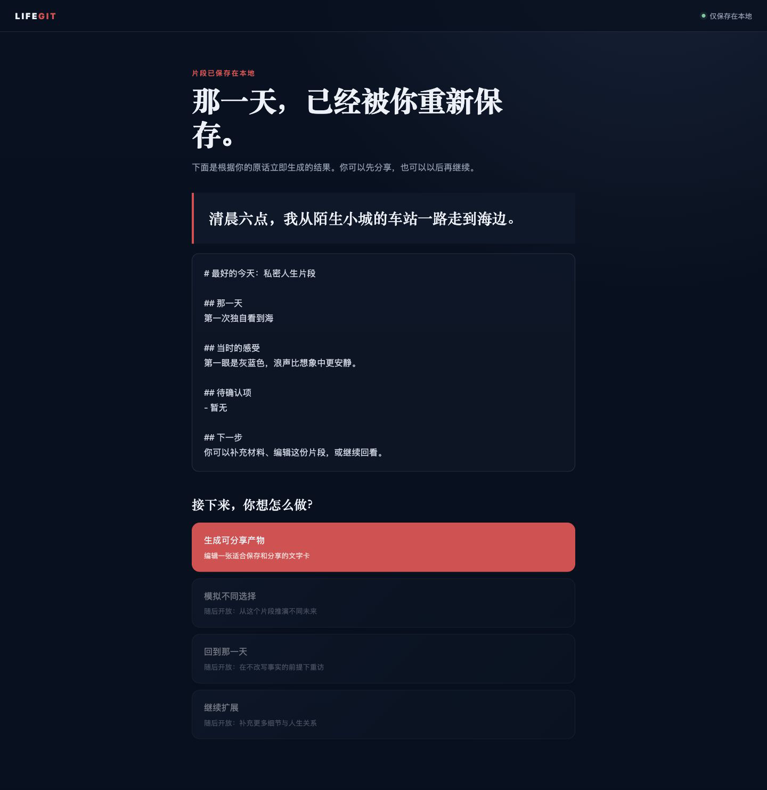
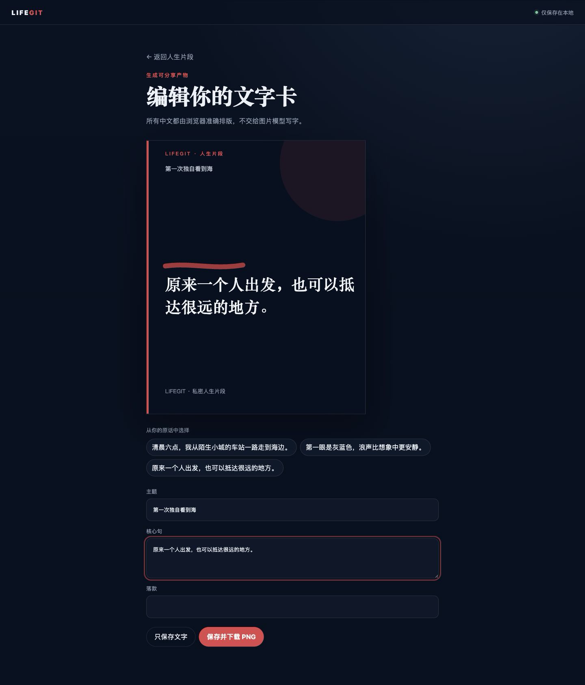

# LifeGit

把人生片段留在自己的电脑里，也让 AI 在你愿意时帮你看见它。

> 当前正式支持：macOS + Codex 桌面版｜版本：v0.1.0｜作者：learndatabeatiful

## 现在就安装

开始前，请确认你已经打开 Codex，并且当前网络能够访问 GitHub。

**你要做什么**

把下面整段复制给 Codex：

```text
请使用 $skill-installer 从这个 GitHub 仓库安装 LifeGit：
https://github.com/learndatabeatiful/LifeGit

安装完成后，使用 $lifegit 打开 LifeGit。
私人数据目录固定为 ~/Documents/LifeGit-data。
如果 Skill 暂未被识别，请告诉我是否需要重启 Codex。
```

**你应该看到什么**

Codex 告诉你 LifeGit 已安装，并打开一个只有本机可以访问的 LifeGit 网页。

**如果没有看到，怎么办**

让 Codex 检查安装结果；如果它说 Skill 暂未识别，重启一次 Codex，再发送“使用 `$lifegit` 打开 LifeGit。”。不要反复覆盖安装。

## 以后每天怎么打开

**你要做什么**

告诉 Codex：

```text
使用 $lifegit 打开 LifeGit。
```

**你应该看到什么**

LifeGit 自动复用 `~/Documents/LifeGit-data`，并显示未完成或最近完成的人生片段。

**如果没有看到，怎么办**

让 Codex 检查 LifeGit 本地服务状态并重新打开；不要删除数据目录。

## 第一次记录

三个入口没有高低之分：

- “回到那一天”：记录一个你想重新看见、理解或对当时自己说句话的过去瞬间。
- “最好的今天”：记录此刻值得留下的日落、海边、朋友、演唱会或普通一天。
- “后来的我们”：从现在出发，看清一个选择可能把生活带向哪里；v0.1.0 先保存片段和出口，完整推演随后升级。

你可以用完全虚构的练习主题“第一次独自看到海”：写下到达海边的时间、第一眼看到的颜色，以及最想对那天自己说的话。

**你要做什么**

选择一个入口，写一个锚点，再回答最多三个问题。问题可以少写、跳过或稍后继续。

**你应该看到什么**

第三问结束后，点击“生成我的人生片段”。本地原文成果立即出现，不需要等待 AI。页面会列出四个出口：快速分享、未来选择、回到那一天和继续扩展。v0.1.0 只有“生成可分享产物”（快速分享）可用；其余三个显示“随后开放”，暂时不可点击。

**如果没有看到，怎么办**

刷新页面或重新打开 LifeGit；已保存内容会从本地工作区恢复。AI 暂时不可用也不影响原文成果。

## 原文、AI 提炼和分享卡有什么不同

- 本地原文：忠实保存你的回答，不依赖模型。
- AI 提炼：你确认隐私预览后，当前 Agent 才能处理脱敏文字。
- 分享卡：浏览器本地生成的 1080 × 1350 中文 PNG；你可以先改标题、正文和落款，再保存。

**你要做什么**

在成果页选择分享卡模板，确认预览，点击“保存 PNG”。

**你应该看到什么**

浏览器下载一张 1080 × 1350 PNG；同一片段再次导出会保存新版本，不覆盖旧图。

**如果没有看到，怎么办**

先选择纯文字模板再导出。图片能力失败时，纯文字卡仍然可用。







## 你的内容去了哪里

| 内容 | 默认去向 |
| --- | --- |
| 会话、回答、卡片和导出 | `~/Documents/LifeGit-data` |
| Skill 程序 | Codex 本地 Skill 目录 |
| 未确认的文字 | 不创建 AI 任务 |
| 确认后的脱敏文字 | 当前 Agent 使用的模型 |
| 隐私映射 | 只在本地数据目录 |
| 无文字抽象背景提示 | 确认后交给当前可用图片能力 |

**本地存储不等于模型完全不接触内容。** 未列入脱敏清单的信息默认不脱敏；如果你拒绝模型处理，仍然可以完成原文成果和纯文字卡。

## 关闭和下次继续

关闭网页不会删除片段。下次只要再次发送“使用 `$lifegit` 打开 LifeGit。”，就能继续未完成片段或打开最近成果。

## 手动更新、回滚和卸载

LifeGit 不后台检查或静默安装更新。需要更新时发送：

```text
使用 $lifegit 检查并更新 LifeGit。
```

Codex 会先告诉你当前版和目标版，验证下载包，备份旧程序，再切换版本；验证或启动失败会恢复旧版。更新和回滚都不修改 `~/Documents/LifeGit-data`。

卸载时告诉 Codex“使用 `$lifegit` 卸载 LifeGit，但保留我的人生数据”。**卸载 LifeGit 不会删除人生数据。** 删除 `~/Documents/LifeGit-data` 是另一件事，必须由你再次明确确认。

## 按你看到的现象排查

- 找不到 `$lifegit`：重启一次 Codex，再检查安装结果；不要重复覆盖安装。
- GitHub 下载失败：保留当前状态，网络恢复后重试；不会留下半安装目录。
- 网页没有打开：让 Codex 检查本地服务状态并重新打开。
- 数据目录已有内容：LifeGit 会复用已有工作区；遇到未知文件会停下，不会清空。
- AI 一直等待：先使用本地原文和纯文字卡，稍后重新打开最近成果。
- 图片生成失败：继续使用纯文字卡。
- 更新验证失败：旧版继续可用。
- 卸载失败：人生数据不受影响。
- 权限不足：只允许 Codex 访问 Skill 程序目录和 `~/Documents/LifeGit-data`，不需要开放整个磁盘。

<details>
<summary>给熟悉终端的用户：如何运行公开包自检</summary>

在公开仓库根目录运行 `python3 -m unittest discover -s tests -p 'test_*.py' -v`，再到 `web/` 运行 `node --test`。普通用户不需要执行这些命令。

</details>

## 边界

v0.1.0 不提供云同步、遥测、社交平台直发、短片或完整未来推演。WorkBuddy、Claude Code、OpenClaw 和 Hermes 可以尝试通用 Skill 安装，但尚未列入正式支持范围。
